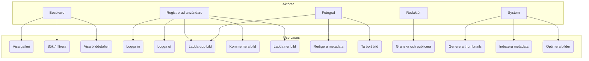
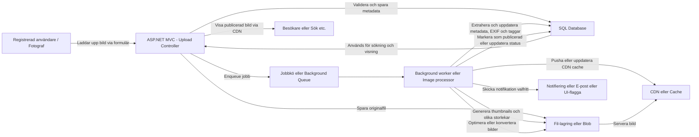

# ArvidsonFoto-MVC .NET web
Ombyggnation av ArvidsonFoto med MVC och .NET (uppgraderad från .NET5 till .NET6 till .NET8 till .NET9... osv. till senaste .NET)

## Funktioner

- 📸 Bildgalleri med kategorier
- 🌍 **Flerspråksstöd** - Svenska och Engelska (se [Lokalisering](#lokalisering))
- 📝 Gästbok
- 🔍 Bildsökning
- 📧 Kontaktformulär
- 👤 Användarhantering med Identity
- 📊 Admin-gränssnitt för bilduppladdning

## Lokalisering

Webbplatsen stöder nu flerspråkighet med svenska (sv-SE) och engelska (en-US). Användare kan växla språk via en språkväljare i navigeringsmenyn.

För mer information om hur lokaliseringen fungerar och hur man lägger till nya översättningar, se [LOCALIZATION.md](docs/LOCALIZATION.md).
  
  
## Instruktion för att starta webbsidan lokalt
För att starta webbsidan så är det några steg man behöver genomföra. 
1. Kommentera bort ```modelBuilder.InitialDatabaseSeed();``` (ca rad 163) i **[/ArvidsonFoto/Data/ArvidsonFotoDbContext.cs](https://github.com/pownas/ArvidsonFoto-MVC-NET8/blob/main/ArvidsonFoto/Data/ArvidsonFotoDbContext.cs#L163)** , för att kunna skapa en ny databas med dess tillhörande data. 
2. Kör entityframework databas uppdateringar: 
```dotnet ef database update --context ArvidsonFotoDbContext```  
```dotnet ef database update --context ArvidsonFotoIdentityContext```
3. Vill du skapa nya användare för att komma åt: **https://localhost:44300/UploadAdmin**, så behöver du kommentera tillbaka all kod på sidan: **[/ArvidsonFoto/Areas/Identity/Pages/Account/Register.cshtml](https://github.com/pownas/ArvidsonFoto-MVC-NET8/blob/main/ArvidsonFoto/Areas/Identity/Pages/Account/Register.cshtml)**
4. Nu kan du registrera nya användare och sedan logga in på sidan **/UploadAdmin** också. 
  
  
## Skapa nya Migrations
För att skapa någon ny migration om en data-modell ändras på, kör kommandot: 
```dotnet-ef migrations add DatabaseSeed --context ArvidsonFotoDbContext```
  
  
## Fel vid körning med EF-core
Om du får ett felmeddelande när du kör: ```dotnet-ef database update```, som säger:  
```
Could not execute because the specified command or file was not found.
Possible reasons for this include: 
  * You misspelled a build-in dotnet command.
  * You intended to execute a .NET program , but dotnet-ef does not exist.
  * You intended to run a global tool, but dotnet-prefixed executable with this name could not be found on the PATH.
```  
  
Då behöver du installera dotnet-ef CLI (dotnet entity framework), som installeras via kommandot:  
```dotnet tool install --global dotnet-ef```

## Uppdatera entityframework till senaste versionen
Uppdatera din dotnet-ef till version 10.0.0 eller högre med kommandot:  
```dotnet tool update --global dotnet-ef```

Eller via CURL: 
```sh
  Write-Host "Installing .NET 10 SDK using Microsoft's installation script..."
  curl -sSL https://dot.net/v1/dotnet-install.sh | bash /dev/stdin --version latest --channel 10.0
    
  Write-Host "Configuring PATH for .NET..."
  export PATH="$HOME/.dotnet:$PATH"
  echo 'export PATH="$HOME/.dotnet:$PATH"' >> ~/.bashrc
```

## Installera developer-certifikat
Om du får felmeddelande när du kör webbsidan lokalt, som säger:  
```
Unable to configure HTTPS endpoint. No server certificate was specified, and the default developer certificate could not be found.
```
Då behöver du installera ett developer-certifikat med kommandot:  
```ps
# Rensa bort alla gamla certifikat
dotnet dev-certs https --clean
# Installera ASP.NET Core HTTPS development certifikat
dotnet dev-certs https --trust
```


## Systemdokumentation


## Diagram och Beskrivningar

Detta dokument innehåller två olika diagram som beskriver funktionaliteten och arkitekturen i projektet **ArvidsonFoto-MVC-NET-web**. Diagrammen är skapade för att ge en överblick av användningsfall och tekniska flöden i applikationen.

---

### 1. Aktörer och Användningsfall (Use-case)

**Beskrivning**
Detta dokument innehåller två olika diagram som beskriver funktionaliteten och arkitekturen i projektet **ArvidsonFoto-MVC-NET-web**. Diagrammen är skapade för att ge en överblick av användningsfall och tekniska flöden i applikationen.

Detta flödesschema visualiserar de olika aktörerna i systemet och deras interaktion med olika funktionella mål (use cases).



### 2. Flödesschema: Bilduppladdning till Publicering

**Beskrivning**

Detta diagram visar det tekniska flödet för en bilduppladdning, från användarens gränssnitt till lagring och bearbetning i bakgrunden, och slutligen publicering och visning via CDN. Flödet innefattar steg som validering, lagring, jobbköer och bakgrundsprocesser.



